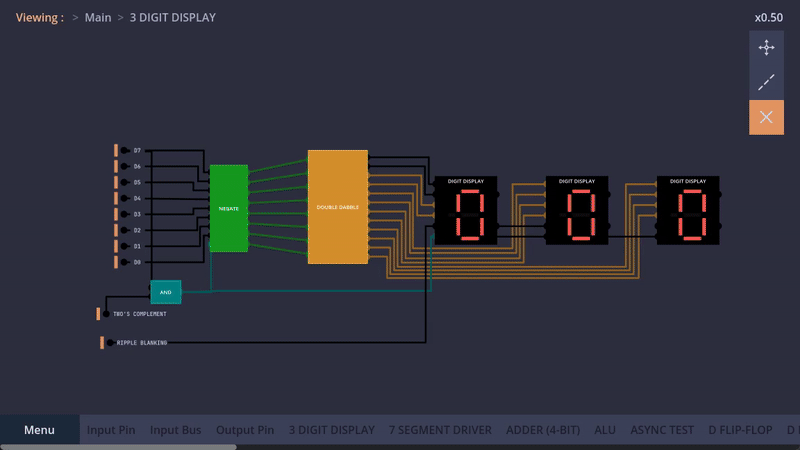
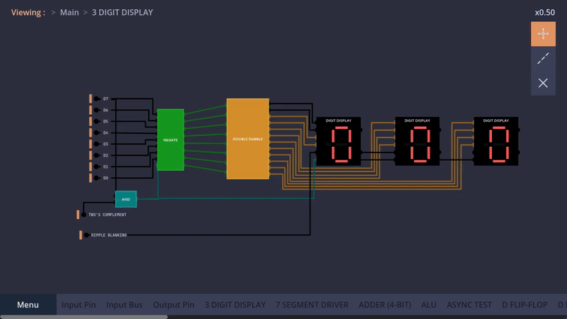
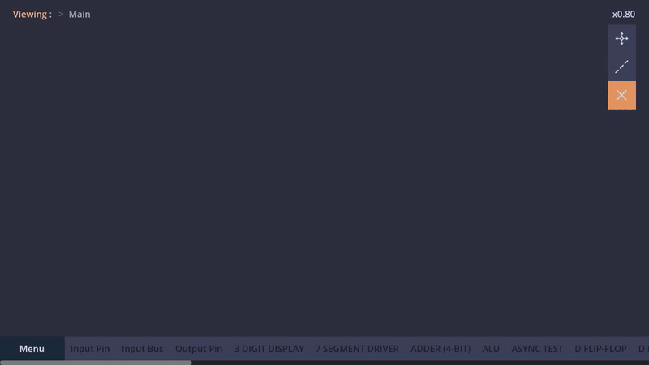
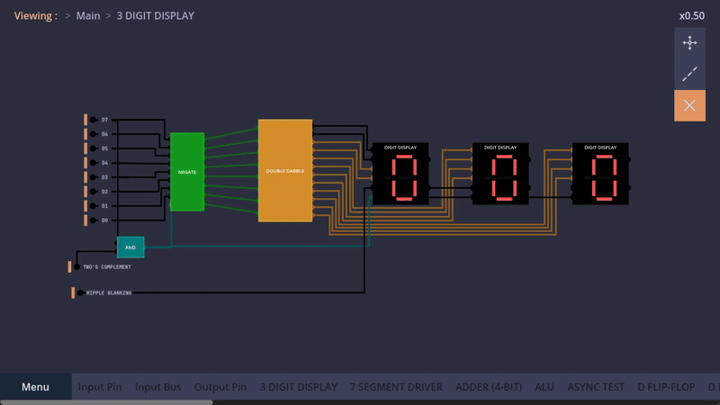

# SimuLogic: Real-Time Digital Logic Simulator in Godot 4

## Overview

SimuLogic is a modular digital logic simulator developed entirely in Godot 4. Designed as an independent academic challenge by an undergraduate electrical engineering student, the project explores low-level gate logic, chip nesting, and real-time signal propagation. The simulator enables users to construct, interact with, and analyze custom digital circuits in a scalable and structured environment.

The long-term goal is to simulate a complete computer system from primitive logic gates within SimuLogic itself.

## Screenshots and Demonstrations

### Nested Chip Design

_An example of modular chip nesting with reusable logic blocks._

### Signal Propagation

_Demonstrates event-driven updates and stable feedback behavior._

### Component Library Interface

_Search and insert pre-built components into the workbench._

### Workbench Interaction

_Scalable design canvas supporting dynamic navigation._

## Features

- **Chip Nesting**: Create reusable logic units and embed them within other circuits.
- **Event-Based Signal Propagation**: Efficient updates triggered only by relevant state changes.
- **Frame-Controlled Simulation**: Stable feedback handling with deferred updates across frames.
- **Customizable Simulation Speed**: Adjustable frame rate for performance tuning.
- **Serialization System**: Save and load chips, components, and workbenches.
- **Scalable Workbench**: Pan and zoom across an expansive design canvas.
- **UI/Logic Decoupling**: Independent systems for optimized performance and modularity.
- **Component Library**: Search and insert predefined logic elements.
- **Interactive Design Tools**: Wire, rewire, reposition, and inspect components dynamically.
- **State Logging**: Track pin transitions, errors, and timing for analysis.

## Architecture

SimuLogic is structured around modular systems:

- **Logic Core**: Manages signal flow, chip behavior, and simulation frames.
- **UI Layer**: Handles user interaction, rendering, and component manipulation.
- **Event System**: Dispatches targeted updates to minimize computation.
- **Serialization Engine**: Stores and restores user-defined components and layouts.
- **Logging System**: Records simulation events for debugging and future extensions.

## Technologies Used

- Godot Engine 4.4.1
- GDScript
- Custom resource serialization

## Future Improvements

- Bus system for grouped signal communication
- Multi-bit pin support (4-bit, 8-bit, 16-bit I/O)
- Enhanced performance optimization
- Expanded component library and blueprint sharing

## License

This project is licensed under **MIT**, allowing open-source collaboration and modifications.